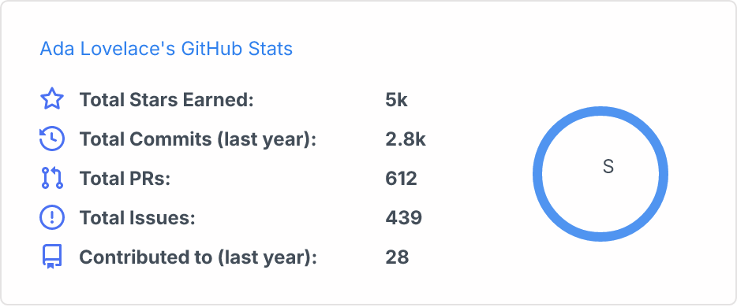
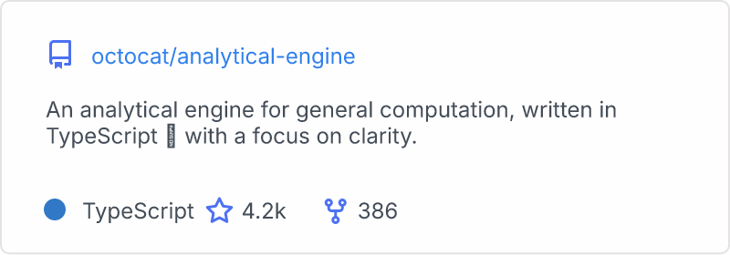
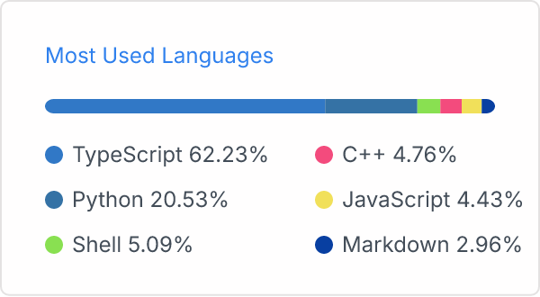
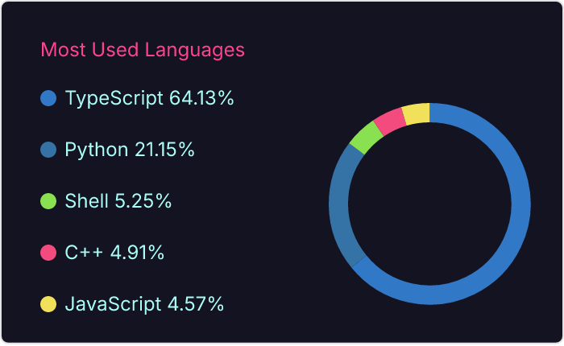

<div align="center">
  <h1>gh-readme-card</h1>
  <p>SVG stat cards for your GitHub profile README, generated by a GitHub Action.</p>
</div>

`gh-readme-card` renders three kinds of card — your commit and PR summary, a
repository summary, and a language breakdown — and commits the SVG files into
your profile repository. A scheduled workflow keeps them fresh; your README
embeds the files with a relative path, so nothing is fetched at render time and
no service of ours is involved.

- **No build step.** The action runs `src/cli.ts` directly, because Node
  executes TypeScript on its own.
- **No HTTP layer.** There is no server, no CDN and no cache to invalidate,
  because the output is a file in your repository.
- **No API beyond GitHub's.**

## Example output

Generated by the real renderer against sample data. The SVGs are in
[demo](./demo) if you want the files themselves.

<table>
<tr>
<td align="center"><strong>Stats</strong></td>
<td align="center"><strong>Repository</strong></td>
</tr>
<tr>
<td></td>
<td></td>
</tr>
<tr>
<td colspan="2" align="center"><strong>Languages</strong> — <code>compact</code>, and <code>donut</code> in the <code>radical</code> theme</td>
</tr>
<tr>
<td></td>
<td></td>
</tr>
</table>

---

## Contents

- [Example output](#example-output)
- [Usage](#usage)
- [Cards](#cards)
- [Options](#options)
- [Themes](#themes)
- [Local development](#local-development)
- [How it works](#how-it-works)
- [Relationship to github-readme-stats](#relationship-to-github-readme-stats)
- [Licence](#licence)

---

## Usage

Add a workflow to your profile repository (`<your-username>/<your-username>`):

```yaml
name: Update README cards

on:
  schedule:
    - cron: "0 3 * * *" # daily at 03:00 UTC
  workflow_dispatch:

permissions:
  contents: write # to commit the generated files

jobs:
  update:
    runs-on: ubuntu-latest
    steps:
      - uses: actions/checkout@v4

      - uses: h1s97x/gh-readme-card@main
        with:
          card: user
          params: "username=${{ github.repository_owner }}&show_icons=true"
          path: profile/user.svg

      - uses: h1s97x/gh-readme-card@main
        with:
          card: repo
          params: "username=${{ github.repository_owner }}&repo=your-repo"
          path: profile/repo.svg

      - uses: h1s97x/gh-readme-card@main
        with:
          card: langs
          params: "username=${{ github.repository_owner }}&layout=compact"
          path: profile/langs.svg

      - name: Commit
        run: |
          git config user.name "github-actions[bot]"
          git config user.email "41898282+github-actions[bot]@users.noreply.github.com"
          git add profile/*.svg
          git diff --staged --quiet || git commit -m "Update cards"
          git push
```

Then reference the files from your profile README. GitHub stacks images
vertically by default, so use `align` to set them side by side:

```html
<a href="https://github.com/your-username/your-repo">
  
</a>
<a href="https://github.com/your-username/your-repo">
  
</a>
```

### Inputs

| Name   | Required | Description                                                                       |
| ------ | -------- | --------------------------------------------------------------------------------- |
| `card` | yes      | Which card to render: `user`, `repo` or `langs`                                     |
| `params` | no     | Card options, as a query string. See [Options](#options)                           |
| `path` | yes      | Where to write the SVG, relative to the workspace. Missing directories are created |
| `token` | no      | Token for the API call. Defaults to the one GitHub provides (`github.token`)        |

Two defaults are worth knowing:

- With the default token the cards only see **public** data. For private
  repositories, add a `PAT` secret and pass it as `token`.
- The `github.token` GitHub provides is read-only, which is enough here: the
  action only reads from the API. Writing to the repository uses the workflow's
  own `permissions` block, not this token.

---

## Cards

### `card=user`

Your activity summary: stars, commits, pull requests, issues, contributions,
and a rank.

```yaml
- uses: h1s97x/gh-readme-card@main
  with:
    card: user
    params: "username=octocat&show_icons=true&theme=dark"
    path: profile/user.svg
```

`username` is required. Commits are counted for the current year unless you say
otherwise — see `include_all_commits` and `commits_year` below.

**About the rank.** The letter grade comes from comparing each statistic
against a hand-picked median, combined with fixed weights. Those medians are
inherited from the original project and are not derived from a published
dataset, so read the letter as a rough indication rather than a percentile. The
circle around it animates from full to `100 − percentile`; it is a visual, not
a measurement.

### `card=repo`

A single repository: description, primary language, stars and forks, plus
badges for archived and template repositories.

```yaml
- uses: h1s97x/gh-readme-card@main
  with:
    card: repo
    params: "username=octocat&repo=hello-world&show_owner=true"
    path: profile/repo.svg
```

`username` and `repo` are both required. The lookup tries the user namespace
first, then the organization, so it works for either.

### `card=langs`

A breakdown of the languages in your non-forked repositories.

```yaml
- uses: h1s97x/gh-readme-card@main
  with:
    card: langs
    params: "username=octocat&layout=donut&langs_count=8"
    path: profile/langs.svg
```

`username` is required. Colours come from GitHub's own language data; a
language GitHub reports no colour for is drawn in grey.

Five layouts are available: `normal` (default), `compact`, `donut`,
`donut-vertical` and `pie`.

---

## Options

Passed as a query string in `params`, in any order.

### Common to every card

| Name            | Type    | Default   | Description                                           |
| --------------- | ------- | --------- | ----------------------------------------------------- |
| `theme`         | enum    | `default` | One of the [themes](#themes)                          |
| `title_color`   | hex     | theme     | Card title colour                                      |
| `text_color`    | hex     | theme     | Body text colour                                       |
| `icon_color`    | hex     | theme     | Icon colour                                            |
| `bg_color`      | hex     | theme     | Background. Accepts `angle,stop,stop…` for a gradient |
| `border_color`  | hex     | theme     | Border colour                                          |
| `border_radius` | number  | `4.5`     | Corner rounding                                        |
| `hide_border`   | boolean | `false`   | Draw no border                                         |
| `locale`        | enum    | `en`      | `en`, `cn` or `zh-tw`                                 |

### `card=user`

| Name                  | Type    | Default   | Description                                                                     |
| --------------------- | ------- | --------- | ------------------------------------------------------------------------------- |
| `username`            | string  | —         | **Required**                                                                     |
| `hide`                | list    | —         | Hide any of `stars,commits,prs,issues,contribs`                                 |
| `show`                | list    | —         | Add any of `reviews,discussions_started,discussions_answered,prs_merged,prs_merged_percentage` |
| `show_icons`          | boolean | `false`   | Show an icon next to each figure                                                |
| `hide_title`          | boolean | `false`   | Drop the card title                                                             |
| `hide_rank`           | boolean | `false`   | Drop the rank and narrow the card                                               |
| `card_width`          | number  | `287`     | Card width in pixels                                                            |
| `rank_icon`           | enum    | `default` | `default`, `github` or `percentile`                                             |
| `ring_color`          | hex     | theme     | Colour of the rank circle                                                       |
| `include_all_commits` | boolean | `false`   | Count commits from all years, not just this one                                  |
| `commits_year`        | number  | this year | Count commits from one year only                                                 |
| `line_height`         | number  | `25`      | Line spacing between figures                                                    |
| `text_bold`           | boolean | `true`    | Bold the labels                                                                 |
| `number_format`       | enum    | `short`   | `short` (`6.6k`) or `long` (`6626`)                                             |
| `number_precision`    | number  | —         | Digits after the decimal point, 0–2. Only for `short`                           |
| `custom_title`        | string  | auto      | Replace the default title                                                       |
| `disable_animations`  | boolean | `false`   | Turn off the rank animation                                                     |
| `exclude_repo`        | list    | —         | Repositories to leave out of the star count                                     |

### `card=repo`

| Name                      | Type    | Default  | Description                 |
| ------------------------- | ------- | -------- | --------------------------- |
| `username`                | string  | —        | **Required**                 |
| `repo`                    | string  | —        | **Required**                 |
| `show_owner`              | boolean | `false`  | Include the owner's username |
| `description_lines_count` | number  | auto     | Description lines, 1–3      |

### `card=langs`

| Name                 | Type    | Default       | Description                                        |
| -------------------- | ------- | ------------- | -------------------------------------------------- |
| `username`           | string  | —             | **Required**                                        |
| `layout`             | enum    | `normal`      | `normal`, `compact`, `donut`, `donut-vertical` or `pie` |
| `langs_count`        | number  | `5` or `6`    | Languages to show, 1–20. Defaults differ by layout |
| `hide`               | list    | —             | Language names to omit                              |
| `exclude_repo`       | list    | —             | Repositories to leave out                           |
| `hide_title`         | boolean | `false`       | Drop the card title                                 |
| `hide_progress`      | boolean | `false`       | Drop bars and percentages; implies `compact`        |
| `card_width`         | number  | `300`         | Card width in pixels                                |
| `stats_format`       | enum    | `percentages` | `percentages` or `bytes`                            |
| `size_weight`        | number  | `1`           | Weight on bytes when ranking                        |
| `count_weight`       | number  | `0`           | Weight on repository count when ranking             |
| `custom_title`       | string  | auto          | Replace the default title                           |
| `disable_animations` | boolean | `false`       | Turn off the progress animation                     |

`size_weight` and `count_weight` decide the ranking:

- `size_weight=1&count_weight=0` — by bytes (default)
- `size_weight=0.5&count_weight=0.5` — by both, which is often fairer
- `size_weight=0&count_weight=1` — by how many repositories use the language

---

## Themes

`default`, `dark`, `radical`, `merko`, `gruvbox`, `tokyonight`, `onedark`,
`cobalt`, `synthwave`, `highcontrast`, `dracula`, `transparent`.

`transparent` has no background, which is what you want if one card has to
read correctly on both of GitHub's themes:

```html
<picture>
  <source media="(prefers-color-scheme: dark)" srcset="./profile/user-dark.svg" />
  
</picture>
```

---

## Local development

Requires Node 22 or newer. There is no build step, so the entry point runs
directly:

```bash
PAT_1=ghp_yourtoken \
GH_CARD_CARD=user \
GH_CARD_PARAMS="username=octocat&show_icons=true" \
GH_CARD_PATH=out/user.svg \
node src/cli.ts
```

Outside an Action the inputs are read from `GH_CARD_*` rather than `INPUT_*`,
which is why that prefix exists — an unprefixed `PATH` would otherwise pick up
the shell's search path and aim the card at a system directory.

To read a local `.env` file, let Node handle it:

```bash
node --env-file=.env src/cli.ts
```

### Checks

```bash
npm test           # vitest
npm run typecheck  # tsc --noEmit, strict
npm run lint       # eslint
npm run format     # prettier --write
```

---

## How it works

```
.github/workflows/*.yml        the workflow that drives everything
        │
        ▼
action.yml ──▶ src/cli.ts      read inputs, render one card
                  │
                  ├──▶ src/fetchers/    GitHub GraphQL, one call per card
                  ├──▶ src/cards/       data ──▶ SVG string
                  └──▶ writes the file
                             │
                             ▼
                  profile/*.svg           committed to your repository
                             │
                             ▼
                  README references ./profile/*.svg
```

Three layers, and no more:

- `src/cli.ts` — the only place that knows about inputs and files
- `src/cards/` — pure functions: data in, SVG out
- `src/fetchers/` — GitHub API calls, with token rotation and rate-limit
  handling

Nothing under `src/cards/` or `src/fetchers/` knows that a file or an HTTP
request exists, which is what keeps them straightforward to test.

### Rate limits

A GitHub token allows 5,000 requests per hour and each card costs one. A
personal token with `repo` scope also reads private repositories. Supply
several as `PAT_1`, `PAT_2`, … and the fetcher rotates between them when one
is rate-limited.

Stars are counted across the first 100 repositories only, because the account
listing is already sorted by stars and a user with more than 100 repositories
costs a great deal of rate limit for a small correction. Set
`FETCH_MULTI_PAGE_STARS=true` in the workflow environment to page through them
all.

---

## Relationship to github-readme-stats

This project is an independent rewrite of
[`github-readme-stats`](https://github.com/anuraghazra/github-readme-stats) by
Anurag Hazra, which is no longer maintained upstream. It began as a fork and
now shares little beyond the idea of drawing a GitHub profile's numbers as an
SVG.

What came from upstream and remains under its original MIT copyright: the card
rendering approach, the `Card` base class and the layout primitives, the colour
and theme system, the retry behaviour, and the translations. See
[NOTICE.md](./NOTICE.md) for the full breakdown.

What this project changed: TypeScript throughout, an Action rather than a Vercel
service, three cards instead of five, twelve themes instead of seventy-five,
and no dependency on a CDN being reachable.

You are welcome to use either project. This one is smaller because it only does
what it does.

---

## Licence

MIT. See [LICENSE](./LICENSE), which carries the original copyright alongside
this project's, as the licence requires.
